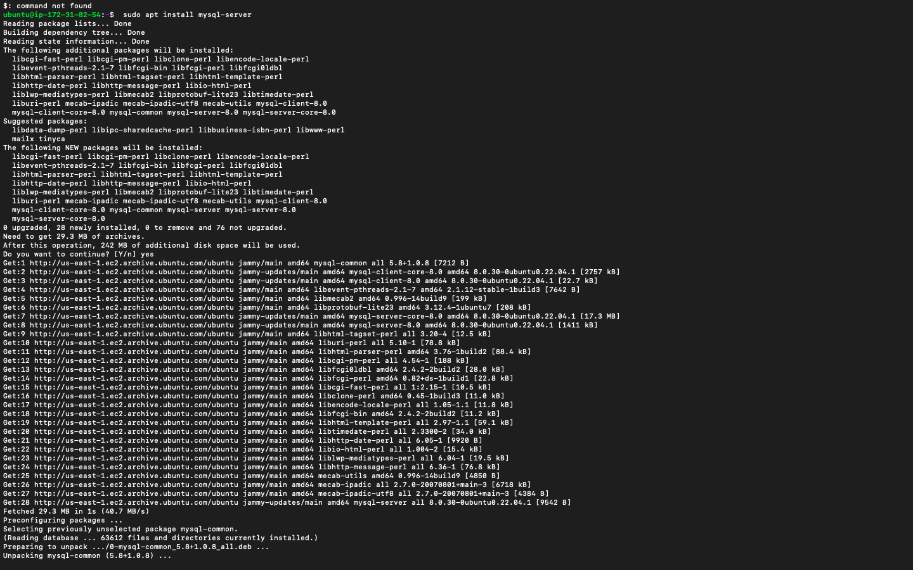
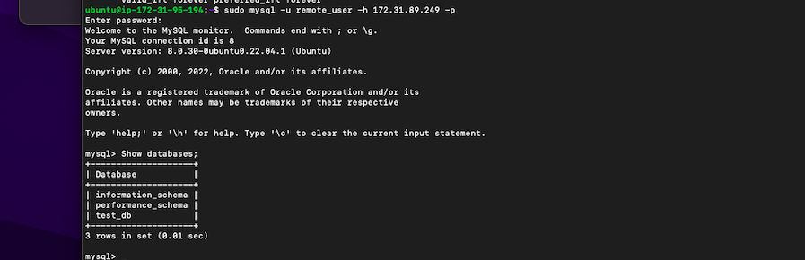

MPLEMENTING A CLIENT SERVER ARCHITECTURE USING MYSQL DATABASE MANAGEMENT SYSTEM (DBMS).

 The task of the project is to implement a Client Server Architecture using MySQL Database Management System (DBMS).

 Client-Server refers to an architecture in which two or more computers are connected together over a network to send and receive requests between one another.

 In their communication, each machine has its own role: the machine sending requests is usually referred as "Client" and the machine responding (serving) is called "Server".

 In the example above, a machine that is trying to access a Web site using Web browser or simply ‘curl’ command is a client and it sends HTTP requests to a Web server (Apache, Nginx, IIS or any other) over the Internet.

 - Create and configure two Linux-based virtual servers (EC2 instances in AWS).

 1. Server A name - `mysql server`
 2. Server B name - `mysql client`

 - On mysql server Linux Server install MySQL Server software.

 `sudo apt update`

 `sudo apt install mysql-server`

 the result is;
 
 

 - check the status of mysql

 `sudo systemctl status mysql`

 - On mysql client Linux Server install MySQL Client software.

 `sudo apt update`

 `sudo apt install mysql-client`
 

 - Update the inbound rules in MYSQL server, by adding TCP port 3306. For extra security allow access only to private IP address of MYSQL client.

 the result is;
 

 - In MYSQL server, run the security script to prepare mysql database

 `sudo mysql_secure_installation`
 

 - Follow the instructions and set a new password.

 - open mysql

 `sudo mysql`

 - Create a remote user by running

 `CREATE USER 'remote user'@'%' IDENTIFIED WITH mysql_native_password BY 'PASSWORD';`

 - Create database by running

 `CREATE DATABASE test_db;`

 - grant all privileges on the database 

 `GRANT ALL ON test_db.* TO 'remote user'@'%' WITH GRANT OPTION;`

 - Flush Privileges

 `FLUSH PRIVILEGES;`

 - Exit mysql

 - Configure MYSQL server to allow connections from remote hosts

 `sudo vi /etc/mysql/mysql.conf.d/mysqld.cnf`

 - Replace ‘127.0.0.1’ to ‘0.0.0.0’

 - from mysql client Linux Server connect remotely to mysql server Database Engine

 the result is

 

 - Confirm successfully connection to the remote MySQL server and perform SQL queries by running

 `show databases;`

 the result is;
 
